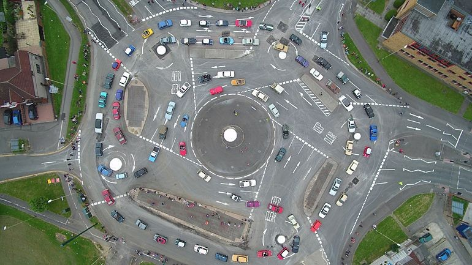

# Bio

My name is __Christoph Reif__ and I am __private researcher__ in computing. The word of a [research](https://www.merriam-webster.com/dictionary/research) als includes the word *search*.

I am just *search*ing for peaces that fit together to build a picture about the __[truth](https://www.merriam-webster.com/dictionary/truth) about computing__. Like in a [jigsaw puzzle](https://www.merriam-webster.com/dictionary/jigsaw%20puzzle). You just put the [right](https://www.merriam-webster.com/dictionary/right) [parts](https://www.merriam-webster.com/dictionary/parts) that fits together until you see the [whole](https://www.merriam-webster.com/dictionary/whole) image.

## True and Truth

There are parts that are true and parts that are not true. They only seems true to our reasoning. But when you test it properly, you see that this parts are not really true. If you remove and all not true parts and set the true parts together you will see a picture. **Truth is hard to find** today, because everybody has an opinion today. We have a sayings: "Opinions are like noses, everyone has one!"

Truth never get killed. It is like a seed in the dessert. If the rain comes, the flowers with grow.
A [desert bloom](https://en.wikipedia.org/wiki/Desert_bloom) is a climatic phenomenon that occurs in various deserts around the world. 

## The future is in the past

When you go back in history you can find the point where the whole IT industrie has turned the wrong.
Like in a [roundabout](https://en.wikipedia.org/wiki/Roundabout), you can enter the roundabout, but you have to decide where to exit the roundabout. Is it going to north? Is it going to south? Is it goind to west or east? Or any other direction. If you choose the wrong direction and you believe you are on the right path then you drive fast. But after 50 years of IT technology you see the fruits. Are the fruits good? Fruits are sign like on the road. That show if you are at the right road. If you drive to south and the sun is not on the right place and you still believe you are drving to south then you should start to think. Are you sure you drive the right directions?

## Signs your are right or wrong

Many does not believe in signs. Signs like [software bloat](https://en.wikipedia.org/wiki/Software_bloat). There are still going to north, but the signs say STOP please turn over, you are going the wrong directions to south. 

I am sure you've ever heard the saying "blind lead the blind". 

Paul Graham wrote in his book ["Hacker & Painter"](http://www.paulgraham.com/hackpaint.html) and in his article ["Revenge of the Nerds](http://www.paulgraham.com/icad.html) about this ongoing problem of the *pointy-haired bosses*.

**Niklas Wirth** wrote 1995 in his aritcle ["A Plea for Lean Software"](https://cr.yp.to/bib/1995/wirth.pdf)
about the signs.

**John Backus** wrote in his article ["Can programming be liberated from the von Neumann style? A functional style and its algebra of programs"](https://dl.acm.org/doi/10.1145/359576.359579)
about the signs.

**Paul Graham** wrote is his remarkable article ["The Roots of Lisp"](http://www.paulgraham.com/rootsoflisp.html) that all languages heading towards Lisp.

## Basic idea

We all have a [neuronal network](https://en.wikipedia.org/wiki/Neural_network) (a real AI) between our ears. This brain is a rule extraction machine. If there are rules in the input, the brain will find the rules. 

We should be careful with which data (=information) we feed our brain(= neuronal network). 

For instance this is how [propaganda](https://www.merriam-webster.com/dictionary/propaganda) works. They feed you with half-truth you can not check.
Then you start to believe this things as they were true, but it is not.

## Future of Computing

Moore's law is the observation that the number of transistors in a dense integrated circuit (IC) doubles about every two years. Computers get more and more cores every two year.

Already John Backus described the problem with the [Neumann's bottleneck](https://en.wikipedia.org/wiki/Von_Neumann_architecture#Von_Neumann_bottleneck) 1977.

Parallel and Concurrent Computing.

Functional programming.

Data Flow Processor Architecture.
