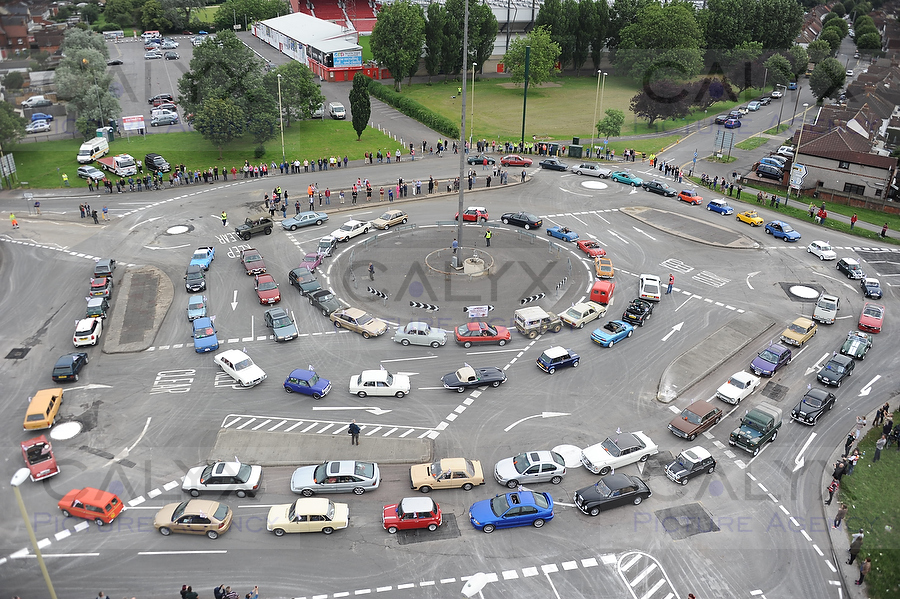

# Bio

My name is Christoph Reif and I am researcher in computer science. The word of a [research](https://www.merriam-webster.com/dictionary/research) als includes the word *search*.

I am just *search*ing for peaces that fit together to build a picture about the [truth](https://www.merriam-webster.com/dictionary/truth) and future of computing. Like in a [jigsaw puzzle](https://www.merriam-webster.com/dictionary/jigsaw%20puzzle). You just put the [right](https://www.merriam-webster.com/dictionary/right) [parts](https://www.merriam-webster.com/dictionary/parts) that fits together until you see the [whole](https://www.merriam-webster.com/dictionary/whole) image.

## True and Truth

There are parts that are true and parts that are not true. They only seems true to our reasoning. But when you test it properly, you see that this parts are not really true. If you remove and all not true parts and set the true parts together you will see a picture. Truth is hard to find today, because everybody has an opinion today. We have a sayings: "Opinions are like noses, everyone has one!"

Truth never get killed. It is like a seed in the dessert. If the rain comes, the flowers with grow.
A [desert bloom](https://en.wikipedia.org/wiki/Desert_bloom) is a climatic phenomenon that occurs in various deserts around the world. 

## The Future always builds on the past

When you go back in history you can find the point where the whole IT industrie has turned the wrong.
Like in a [roundabout](https://en.wikipedia.org/wiki/Roundabout), you can enter the roundabout, but you have to decide where to exit the roundabout. Is it going to north? Is it going to south? Is it goind to west or east? Or any other direction. If you choose the wrong direction and you believe you are on the right path then you drive fast. But after 50 years of IT technology you see the fruits. Are the fruits good? Fruits are sign like on the road. That show if you are at the right road. If you drive to south and the sun is not on the right place and you still believe you are drving to south then you should start to think. Are you sure you drive the right directions?

In the 70s they did a lot of invention, but did not have the hardware we have today. So computer where slow and you have to things you would not do today. These are things that can change. Because now we have the computer power and the reason why we have a lot of things is gone. So todays computer can be 10 times simpler made. The question is why you does not want to remove things that have fallen out of time. We are now 2020 folks and heading 2030 oder 2040. IT industry had to start from scretch otherwise it can not go into a sustainable direction and things get more worse.

## Good or bad Signs 

Signs tell you if you are on the right or wrong path. Many do not believe in signs. They are still heading north despite the sign saying "Stop! Please turn around. You are going the wrong way south!"
I am sure you've ever heard the saying "blind lead the blind". 

*Paul Graham* wrote in his book ["Hacker & Painter"](http://www.paulgraham.com/hackpaint.html) and in his article ["Revenge of the Nerds](http://www.paulgraham.com/icad.html) about this ongoing problem of the *pointy-haired bosses*.

*Niklas Wirth* wrote 1995 in his article ["A Plea for Lean Software"](https://cr.yp.to/bib/1995/wirth.pdf)
about the signs of software bloat.

*John Backus* wrote in his article ["Can programming be liberated from the von Neumann style? A functional style and its algebra of programs"](https://dl.acm.org/doi/10.1145/359576.359579)
about the signs.

*Paul Graham* wrote is his remarkable article ["The Roots of Lisp"](http://www.paulgraham.com/rootsoflisp.html) that all languages heading towards Lisp. This is also a sign that functional programming is the future.

## Feed your brain

We all have a [neuronal network](https://en.wikipedia.org/wiki/Neural_network) (a real AI) between our ears. This brain is a rule extraction machine. If there are rules in the input, the brain will find the rules. We should be careful with which data (=information) we feed our brain (=neural network). For instance this is how [propaganda](https://www.merriam-webster.com/dictionary/propaganda) works. They feed you half-truths that you can't verify. Then you start believing these things as if they're true, but they're not.

## Future of Computing

[Moore's law](https://en.wikipedia.org/wiki/Moore%27s_law) is the observation that the number of transistors in a dense integrated circuit (IC) doubles about every two years. Also CPUs get more and more cores on every generation.

[John Backus](https://en.wikipedia.org/wiki/John_Backus) already described the problem with the [Neumann's bottleneck](https://en.wikipedia.org/wiki/Von_Neumann_architecture#Von_Neumann_bottleneck) in 1977.

I believe we need real parallel and concurrent computing[^1]. Which implies functional programming and for hardware something like a dataflow processor architecture[^2].

---

[^1]: [Concurrent_computing](https://en.wikipedia.org/wiki/Concurrent_computing)
[^2]: [Dataflow Architecture](https://en.wikipedia.org/wiki/Dataflow_architecture)

