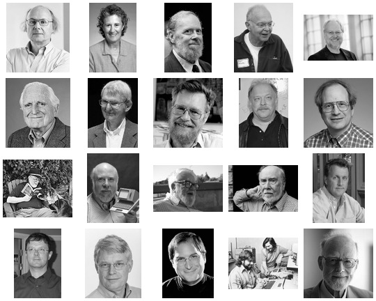

# Pioneers of Computer Science

This is a partial list of notable figures in computer science.

If all these people would work together how would it change the computing industry?

[List of pioneers in computer science](https://en.wikipedia.org/wiki/List_of_pioneers_in_computer_science)

<!-- TODO: TIME LINE -->

## Doug Engelbart (1925) 	

* [Wiki](https://en.wikipedia.org/wiki/Douglas_Engelbart)

## John McCarthy (1927)

* [Homepage](http://www-formal.stanford.edu/jmc/index.html)
* [Roots of Lisp](http://www.paulgraham.com/rootsoflisp.html)
* [Lisp](https://en.wikipedia.org/wiki/Lisp_(programming_language))
* [Recursive Functions of Symbolic Expressions and Their Computation by Machine](http://jmc.stanford.edu/articles/recursive/recursive.pdf)
* [Garbage Collection](https://en.wikipedia.org/wiki/Garbage_collection_(computer_science))
* [John McCarthy, on Philosophy of AI](https://www.youtube.com/watch?v=K13_sWm_gZw)
* [AI winter](https://en.wikipedia.org/wiki/AI_winter)

## Edsger W. Dijkstra (1930)

* [Go To Statement Considered Harmful](https://homepages.cwi.nl/~storm/teaching/reader/Dijkstra68.pdf)

## M. Douglas McIlroy (1932)

* [Wiki](https://en.wikipedia.org/wiki/Douglas_McIlroy)

## Gerald M. Weinberg (1933)

* [The Psychology of Computer Programming](https://geraldmweinberg.com/Site/Programming_Psychology.html)

## Tony Hoare (1934)

* [Null References: The Billion Dollar Mistake](https://www.infoq.com/presentations/Null-References-The-Billion-Dollar-Mistake-Tony-Hoare/)

## Niklaus Wirth (1934)

* [Home at ETH Zürich](https://people.inf.ethz.ch/wirth/)
* [A Plea for Lean Software](https://cr.yp.to/bib/1995/wirth.pdf)
* [Oberon](https://people.inf.ethz.ch/wirth/Oberon/index.html)
* [Project Oberon - The Design of an Operating System, a Compiler, and a Computer](https://people.inf.ethz.ch/wirth/ProjectOberon/PO.System.pdf)
* [Compiler Construction](https://people.inf.ethz.ch/wirth/CompilerConstruction/CompilerConstruction1.pdf)
* [Algorithms and Data Structures](https://people.inf.ethz.ch/wirth/AD.pdf)

## Donald E. Norman	(1935)

* [The Design of Everyday Things](https://jnd.org/the-design-of-everyday-things-revised-and-expanded-edition/)
* [The Design of Future Things](https://jnd.org/the-design-of-future-things/)

## Ivan Sutherland (1938)

* [Wiki](https://en.wikipedia.org/wiki/Ivan_Sutherland)

## Donald E. Knuth (1938)		

* [Homepage](https://cs.stanford.edu/~knuth/)
* [The Art of Computer Programming (TAOCP)](https://cs.stanford.edu/~knuth/taocp.html)
* [A RISC computer for the new millennium](http://www.mmix.cs.hm.edu)

## Barbara Liskov (1939)

* [Homepage](https://pmg.csail.mit.edu/~liskov/)
* [How Data Abstraction changed Computing forever](https://www.youtube.com/watch?v=_jTc1BTFdIo)

## Alan Kay (1940)

* [Power of Simplicity](https://www.youtube.com/watch?v=NdSD07U5uBs)

## Dennis Ritchie (1941)

* [Homepage](https://www.bell-labs.com/usr/dmr/www/)
* [The C Programming Language, Second Edition](https://s3-us-west-2.amazonaws.com/belllabs-microsite-dritchie/cbook/index.html)

## Jef Raskin (1943)

* [The Humane Interface](https://en.wikipedia.org/wiki/The_Humane_Interface)
* [Archy](https://en.wikipedia.org/wiki/Archy_(software))
* [Zooming User Interface](https://en.wikipedia.org/wiki/Zooming_user_interface)

## Ken Thompson (1943)

 * [Go](https://en.wikipedia.org/wiki/Go_(programming_language))
 * [Plan 9](https://en.wikipedia.org/wiki/Plan_9_from_Bell_Labs)

## Gerald Jay Sussmann (1947)

* [Homepage](https://groups.csail.mit.edu/mac/users/gjs/)
* [Flexible Systems, The Power of Generic Operations](https://vimeo.com/151465912)
* [We Really Don't Know How To Compute!](https://www.infoq.com/presentations/We-Really-Dont-Know-How-To-Compute/)
* [Revised Report on the Propagator Model](https://groups.csail.mit.edu/mac/users/gjs/propagators/revised-html.html)

## Steve Woz (1950)

* [Wiki](https://en.wikipedia.org/wiki/Steve_Wozniak)

## Bjarne Stroustrup (1950)

* [Wiki](https://de.wikipedia.org/wiki/Bjarne_Stroustrup)

## Douglas Crockford (1955)

* [Homepage](https://www.crockford.com/)
* [JavaScript: The World's Most Misunderstood Programming Language](http://www.crockford.com/javascript/javascript.html)
* [How JavaScript Works](https://howjavascriptworks.com)
* [The Post JavaScript Apocalypse](https://www.youtube.com/watch?v=NPB34lDZj3E)
* [Principles of Security](https://www.youtube.com/watch?v=zKuFu19LgZA)
* [DEC64](https://www.crockford.com/dec64.html)

## Rob Pike (1956)

* [The Good, the Bad, and the Ugly: The Unix Legacy](http://herpolhode.com/rob/ugly.pdf)
* [Go](https://en.wikipedia.org/wiki/Go_(programming_language))
* [Plan 9](https://en.wikipedia.org/wiki/Plan_9_from_Bell_Labs)

## Paul Graham (1964)

* [Homepage](http://www.paulgraham.com/index.html)
* [The Root of Lisp](http://www.paulgraham.com/rootsoflisp.html)
* [What Made Lisp Different](http://www.paulgraham.com/diff.html)
* [If Lisp is so great](http://www.paulgraham.com/iflisp.html)
* [Taste for Makers](http://www.paulgraham.com/taste.html) - *About good Design*
* [Arc](http://paulgraham.com/arc.html)
* [Bel](http://paulgraham.com/bel.html)

## Robert C. Martin (1952)

* [About](http://cleancoder.com/files/about.md)
* [cleancoders.com](https://cleancoders.com)
* [Future of Programming](https://youtu.be/ecIWPzGEbFc)
* [Clean Architecture and Design](https://www.youtube.com/watch?v=2dKZ-dWaCiU)
* [The Last Programming Language](https://www.youtube.com/watch?v=P2yr-3F6PQo)

## Steve Jobs (1955)

* [Wiki](https://en.wikipedia.org/wiki/Steve_Jobs)

## Tim Berners-Lee (1955)

* [Homepage @ W3C](https://www.w3.org/People/Berners-Lee/)
* [Solid](https://solid.mit.edu)

## Eric S. Raymond (1957)

* [The Art of Unix Programming](https://nakamotoinstitute.org/static/docs/taoup.pdf)
* [Revolution OS](https://youtu.be/NrI-0u4npGo)

## Aza Raskin (Son Jef Raskin)

* [Homepage](https://aza.wtf)

<!--

## Manfred Spitzer		

## James Gosling		

## Martin Odersky		

## Ken Perlin		

## Prof Maurer

## Klaus Hofer	

## Evan Czaplicki	

## (Christoph Reif) Me

-->
