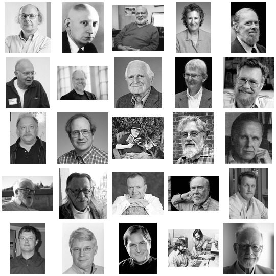

# Pioneers of Computer Science

This is a partial list of notable figures in computer science.

If all these people would work together how would it change the computing industry?

[List of pioneers in computer science](https://en.wikipedia.org/wiki/List_of_pioneers_in_computer_science)

<!-- TODO: TIME LINE -->

## Joseph Weizenbaum (1923)

* [Wiki](https://en.wikipedia.org/wiki/Joseph_Weizenbaum)
* [ELIZA](https://en.wikipedia.org/wiki/ELIZA)
* [SLIP](https://en.wikipedia.org/wiki/SLIP_(programming_language))
* [Weizenbaum. Rebel at Work](http://www.ilmarefilm.org/archive/weizenbaum_archiv_E.html)
* [Plug&Pray](http://plugandpray-film.de/inhalt.html)

> *"Die meisten meiner Kollegen glauben, alles ist berechenbar und wir können eine künstliche Mensche herstellen.
Das hat auch was mit Größenwahn zu tun."*
> ...
> Doch ausgerechnet einer der Pioniere der Computerentwicklung und der künstlichen Intelligenz, der ehemalige MIT-Professor Joseph Weizenbaum, hat sich zum schärfsten Kritiker dieser technologischen Allmachtsvisionen entwickelt. Er betrachtet die weit verbreitete Ansicht, die Natur sei mit Hilfe der Wissenschaft vollkommen zu erfassen und somit objektiv berechenbar, als **katastrophale Fehlentwicklung des menschlichen Denkens**. 

## Alan Perlis (1922 - 1990)

* [In Praise of APL:A Language for Lyrical Programming](https://www.jsoftware.com/papers/perlis77.htm)

> ... The second issue is of a different kind. I am firmly convinced that __APL and LISP are related__ to each other along an important axis of language design and that acquiring simultaneous expertise in both languages is possible and desirable for the beginning student. Were they unified, the set of tasks that succumb to terse, flexible and expressive descriptions will enlarge enormously without overly increasing the intellectual burden on the student over his initial 16 week contact period. ...

* [Alan Perlis Papers 1942-1989](https://archives.lib.umn.edu/repositories/3/resources/58#)

## John Backus (1924)

* [Wiki](https://en.wikipedia.org/wiki/John_Backus)
* [Function level Programming](https://en.wikipedia.org/wiki/Function-level_programming)
* [Can programming be liberated from the von Neumann style?: a functional style and its algebra of programs](https://dl.acm.org/doi/10.1145/359576.359579)
* [BNF](https://en.wikipedia.org/wiki/Backus–Naur_form)
* [EBNF](https://en.wikipedia.org/wiki/Extended_Backus–Naur_form)

> 

## Doug Engelbart (1925) 	

* [Wiki](https://en.wikipedia.org/wiki/Douglas_Engelbart)

## John McCarthy (1927)

* [Homepage](http://www-formal.stanford.edu/jmc/index.html)
* [Roots of Lisp](http://www.paulgraham.com/rootsoflisp.html)
* [Lisp](https://en.wikipedia.org/wiki/Lisp_(programming_language))
* [Recursive Functions of Symbolic Expressions and Their Computation by Machine](http://jmc.stanford.edu/articles/recursive/recursive.pdf)
* [Garbage Collection](https://en.wikipedia.org/wiki/Garbage_collection_(computer_science))
* [John McCarthy, on Philosophy of AI](https://www.youtube.com/watch?v=K13_sWm_gZw)
* [AI winter](https://en.wikipedia.org/wiki/AI_winter)
* [Picture 1960 Algol conference in Paris](http://www-formal.stanford.edu/jmc/pictures.html)

## Peter Naur (1928)

* [Homepage](http://www.naur.com)
* [Wiki](https://en.wikipedia.org/wiki/Peter_Naur)
* [ALGOL60](https://en.wikipedia.org/wiki/ALGOL_60)
* [Peter Naur 2005 - "Computing vs. Human Thinking"](https://www.youtube.com/watch?v=mYivRwrATTA)

## Edsger W. Dijkstra (1930)

* [Go To Statement Considered Harmful](https://homepages.cwi.nl/~storm/teaching/reader/Dijkstra68.pdf)
* [The Humble Programmer (EWD340)](https://www.cs.utexas.edu/~EWD/transcriptions/EWD03xx/EWD340.html)

<small>
> The third project I would not like to leave unmentioned is LISP, a fascinating enterprise of a completely different nature. With a few very basic principles at its foundation, it has shown a remarkable stability. Besides that, LISP has been the carrier for a considerable number of in a sense our most sophisticated computer applications. LISP has jokingly been described as “the most intelligent way to misuse a computer”. I think that description a great compliment because it transmits the full flavour of liberation: it has assisted a number of our most gifted fellow humans in thinking previously impossible thoughts.
<small>

## Jack Dennis (1931)

* [Wiki](https://en.wikipedia.org/wiki/Jack_Dennis)
* [Home @ MIT](http://csg.csail.mit.edu/Users/dennis/)
* [Fresh Breeze: A Novel Multiprocessor Chip](http://csg.csail.mit.edu/Users/dennis/csg-dennis.htm)
* [The Fresh Breeze Model of Thread Execution](http://csg.csail.mit.edu/Users/dennis/pmup-final.pdf)
* [A preliminary architecture for a basic data-flow processor](https://www.deepdyve.com/lp/association-for-computing-machinery/a-preliminary-architecture-for-a-basic-data-flow-processor-Ej0aB8VR5g)
* [Thoughts about Computer Architecture](http://csg.csail.mit.edu/Users/dennis/barc-presentation/sld001.htm)

> In September 1988 the MIT Laboratory for Computer Science celebrated the thirty-fifth anniversary of Project MAC. At that event I pointed out the limitations of conventional multiprocessor architecture:
 
> <small> 
    "Yet present multiprocessors are very limited in their effective application. Their programming tools are absurdly limited and primitive in contrast to those of Multics. There is no automatic management of memory by the system on behalf of its users. Moreover, within the massive research effort now devoted to parallel architecture, hardly any effort is devoted to the problem of improving programmability in any fundamental sense."
</small> 

> Some wild ideas may be the key to a breakthrough: Functional programming; the idea of a memory that directly supports creation and access to data objects, but does not permit updates; hardware-supported allocation and garbage collection of memory. They need to be seriously explored.
 
> At the Project MAC anniversary I explained:

> <small> 
    "... the key idea ... is functional programming: getting away from the burden of sequential programming concepts embedded in our popular programming languages and computer architectures. The ideas to accomplish this advance exist; in fact they have been known for some time. Yet they are not in favor. Why? They do not fall into the current main stream of computer science. They do not solve the *multiprocessor cache problem*--__instead they make it irrelevant__. They do not solve the problem of *shared objects in object-oriented programming*--__they eliminate the problem__. They do not minimize the overhead of *processor synchronization*--__they make it disappear altogether__."
</small>

> Fifteen years later these remarks remain valid. I concluded by saying:

> <small> 
    "The computer systems of today do not realize our original vision from the inception of Project MAC. Yet the opportunity to make our dreams come true is still there. The vision is not obsolete. It is one that will be achieved. I believe the day will come when the ideas are widely accepted and we can move forward to build the Computer Utility. I hope to contribute to its realization and I look forward to enjoying its fruits."
</small>
 
## Prof Arvind

* [Wiki](https://en.wikipedia.org/wiki/Arvind_(computer_scientist))
* [Journal of Functional Programming](https://en.wikipedia.org/wiki/Journal_of_Functional_Programming)
* [Term rewriting systems](https://en.wikipedia.org/wiki/Rewriting#Term_rewriting_systems)

## M. Douglas McIlroy (1932)

* [Wiki](https://en.wikipedia.org/wiki/Douglas_McIlroy)

## Gerald M. Weinberg (1933)

* [The Psychology of Computer Programming](https://geraldmweinberg.com/Site/Programming_Psychology.html)

## Tony Hoare (1934)

* [Null References: The Billion Dollar Mistake](https://www.infoq.com/presentations/Null-References-The-Billion-Dollar-Mistake-Tony-Hoare/)
* [Communicating sequential processes](https://en.wikipedia.org/wiki/Communicating_sequential_processes)
* [QuickSort](https://en.wikipedia.org/wiki/Quicksort)
* [Concurrent Computing](https://en.wikipedia.org/wiki/Concurrent_computing)

## Niklaus Wirth (1934)

* [Home at ETH Zürich](https://people.inf.ethz.ch/wirth/)
* [A Plea for Lean Software](https://cr.yp.to/bib/1995/wirth.pdf)
* [Oberon](https://people.inf.ethz.ch/wirth/Oberon/index.html)
* [Project Oberon (New Edition 2013)](https://people.inf.ethz.ch/wirth/ProjectOberon/index.html)
* [Project Oberon - The Design of an Operating System, a Compiler, and a Computer](https://people.inf.ethz.ch/wirth/ProjectOberon/PO.System.pdf)
* [Compiler Construction](https://people.inf.ethz.ch/wirth/CompilerConstruction/CompilerConstruction1.pdf)
* [Algorithms and Data Structures](https://people.inf.ethz.ch/wirth/AD.pdf)
* [Computer-Pionier Niklaus Wirth: 80 und aktiv](https://www.srf.ch/radio-srf-3/digital/computer-pionier-niklaus-wirth-80-und-aktiv)

## Donald E. Norman	(1935)

* [The Design of Everyday Things](https://jnd.org/the-design-of-everyday-things-revised-and-expanded-edition/)
* [The Design of Future Things](https://jnd.org/the-design-of-future-things/)

## Ivan Sutherland (1938)

* [Wiki](https://en.wikipedia.org/wiki/Ivan_Sutherland)

## Donald E. Knuth (1938)		

* [Homepage](https://cs.stanford.edu/~knuth/)
* [Wiki](https://en.wikipedia.org/wiki/Donald_Knuth)
* [TeX](https://en.wikipedia.org/wiki/TeX)
* [Metafont](https://en.wikipedia.org/wiki/Metafont)
* [Computer_Modern](https://en.wikipedia.org/wiki/Computer_Modern)
* [Web](https://en.wikipedia.org/wiki/Web_(programming_system))
* [Literate Programming](https://en.wikipedia.org/wiki/Literate_programming)
* [The Art of Computer Programming (TAOCP)](https://cs.stanford.edu/~knuth/taocp.html)
* [A RISC computer for the new millennium](http://www.mmix.cs.hm.edu)

## Barbara Liskov (1939)

* [Homepage](https://pmg.csail.mit.edu/~liskov/)
* [Wiki](https://en.wikipedia.org/wiki/Barbara_Liskov)
* [CLU](https://en.wikipedia.org/wiki/CLU_(programming_language))
* [How Data Abstraction changed Computing forever - TEDx](https://www.youtube.com/watch?v=_jTc1BTFdIo)
* [The Power of Abstraction](https://www.youtube.com/watch?v=GDVAHA0oyJU)

## Alan Kay (1940)

* [Power of Simplicity](https://www.youtube.com/watch?v=NdSD07U5uBs)

## Dennis Ritchie (1941)

* [Homepage](https://www.bell-labs.com/usr/dmr/www/)
* [The C Programming Language, Second Edition](https://s3-us-west-2.amazonaws.com/belllabs-microsite-dritchie/cbook/index.html)

## Jef Raskin (1943)

* [The Humane Interface](https://en.wikipedia.org/wiki/The_Humane_Interface)
* [Archy](https://en.wikipedia.org/wiki/Archy_(software))
* [Zooming User Interface](https://en.wikipedia.org/wiki/Zooming_user_interface)

## Ken Thompson (1943)

 * [Go](https://en.wikipedia.org/wiki/Go_(programming_language))
 * [Plan 9](https://en.wikipedia.org/wiki/Plan_9_from_Bell_Labs)

## Andy Tanenbaum (1944)

* [Wiki](https://en.wikipedia.org/wiki/Andrew_S._Tanenbaum)
* [Minix](https://en.wikipedia.org/wiki/Minix)

## Gerald Jay Sussmann (1947)

* [Homepage](https://groups.csail.mit.edu/mac/users/gjs/)
* [Flexible Systems, The Power of Generic Operations](https://vimeo.com/151465912)
* [We Really Don't Know How To Compute!](https://www.infoq.com/presentations/We-Really-Dont-Know-How-To-Compute/)
* [Revised Report on the Propagator Model](https://groups.csail.mit.edu/mac/users/gjs/propagators/revised-html.html)

## Steve Woz (1950)

* [Wiki](https://en.wikipedia.org/wiki/Steve_Wozniak)
* [Apple I](https://en.wikipedia.org/wiki/Apple_I)
* [Apple II](https://en.wikipedia.org/wiki/Apple_II)
* [Woz.org](http://woz.org)

## Bjarne Stroustrup (1950)

* [Wiki](https://de.wikipedia.org/wiki/Bjarne_Stroustrup)

## Douglas Crockford (1955)

* [Homepage](https://www.crockford.com/)
* [JavaScript: The World's Most Misunderstood Programming Language](http://www.crockford.com/javascript/javascript.html)
* [How JavaScript Works](https://howjavascriptworks.com)
* [The Post JavaScript Apocalypse](https://www.youtube.com/watch?v=NPB34lDZj3E)
* [Principles of Security](https://www.youtube.com/watch?v=zKuFu19LgZA)
* [DEC64](https://www.crockford.com/dec64.html)

## Rob Pike (1956)

* [The Good, the Bad, and the Ugly: The Unix Legacy](http://herpolhode.com/rob/ugly.pdf)
* [Go](https://en.wikipedia.org/wiki/Go_(programming_language))
* [Plan 9](https://en.wikipedia.org/wiki/Plan_9_from_Bell_Labs)

## Paul Graham (1964)

* [Homepage](http://www.paulgraham.com/index.html)
* [The Root of Lisp](http://www.paulgraham.com/rootsoflisp.html)
* [What Made Lisp Different](http://www.paulgraham.com/diff.html)
* [If Lisp is so great](http://www.paulgraham.com/iflisp.html)
* [Taste for Makers](http://www.paulgraham.com/taste.html) - *About good Design*
* [Arc](http://paulgraham.com/arc.html)
* [Bel](http://paulgraham.com/bel.html)

## Robert C. Martin (1952)

* [About](http://cleancoder.com/files/about.md)
* [cleancoders.com](https://cleancoders.com)
* [Future of Programming](https://youtu.be/ecIWPzGEbFc)
* [Clean Architecture and Design](https://www.youtube.com/watch?v=2dKZ-dWaCiU)
* [The Last Programming Language](https://www.youtube.com/watch?v=P2yr-3F6PQo)

> 

## Steve Jobs (1955)

* [Wiki](https://en.wikipedia.org/wiki/Steve_Jobs)
* [Apple](https://en.wikipedia.org/wiki/Apple_Inc.)
* [NeXT](https://en.wikipedia.org/wiki/NeXT)

## Tim Berners-Lee (1955)

* [Homepage @ W3C](https://www.w3.org/People/Berners-Lee/)
* [Solid](https://solid.mit.edu)

## Eric S. Raymond (1957)

* [The Art of Unix Programming](https://nakamotoinstitute.org/static/docs/taoup.pdf)
* [Revolution OS](https://youtu.be/NrI-0u4npGo)

## Manfred Spitzer (1958)

* [Wiki](https://en.wikipedia.org/wiki/Manfred_Spitzer)
* [Lernen. Gehirnforschung und die Schule des Lebens](https://www.amazon.de/Lernen-Gehirnforschung-die-Schule-Lebens/dp/3827417236)

<!--

## Aza Raskin (Son Jef Raskin)

* [Homepage](https://aza.wtf)

## James Gosling		

## Martin Odersky		

## Ken Perlin		

* [SIGGRAPH Asia 2011 - Featured Speaker, Ken Perlin](https://www.youtube.com/watch?v=4YnVhTyrYbo)

## Prof Maurer

## Klaus Hofer	

## Evan Czaplicki	

## (Christoph Reif) Me

-->
